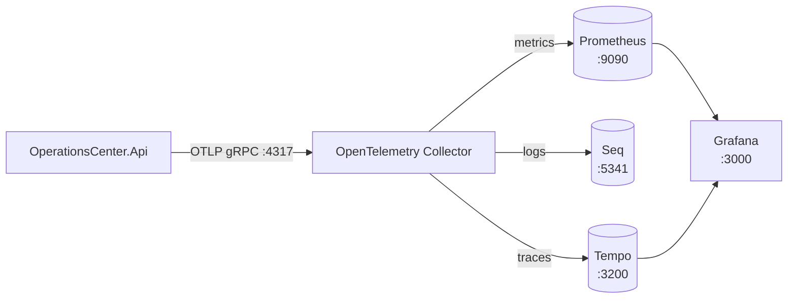

# Operations Center

[](https://github.com/NikolaVetnic/Lab/actions/workflows/operations-center-ci.yml)

Operations Center er et porteføljeprosjekt for en moderne plattform som hjelper organisasjoner med å håndtere hendelser, oppgaver, varsler og sanntidsinformasjon.

Prosjektet bygges som en modulær monolitt først, med tydelige modulgrenser som gjør det mulig å trekke ut separate mikrotjenester senere når det er et reelt behov.

## Mål

Prosjektet skal demonstrere erfaring med:

- .NET og C#
- REST API-er og SignalR
- PostgreSQL og EF Core
- JWT-autentisering og rollebasert autorisasjon
- Bakgrunnsjobber og event-driven kommunikasjon
- Docker og Docker Compose
- GitHub Actions
- Observability med OpenTelemetry, Prometheus og Grafana
- Kubernetes, Helm og Terraform
- Produksjonsrettet sikkerhet, logging og revisjonsspor

## Continuous Integration

CI-workflowen kjører på push til `main` og pull requests mot `main` når endringer treffer dette prosjektets filer (`apps/api/operations-center/**`, `apps/web/**`, `NuGet.config` eller selve workflow-filen), samt manuelt via `workflow_dispatch`.

Den validerer:

- backend-formattering, build og tester
- frontend-formattering, linting og produksjonsbuild
- Docker-build av API- og frontend-images uten publisering

Pull requests skal passere CI før de merges.

## Planlagt funksjonalitet

Operations Center vil etter hvert inneholde støtte for:

- Registrering og behandling av incidents
- Oppgaver knyttet til incidents
- Sanntidsdashboard
- Varslinger via ulike kanaler
- Vedlegg og dokumenthåndtering
- Revisjonsspor
- Søk og filtrering
- Brukere, roller og tilgangsstyring

## Arkitektur

Prosjektet starter som en modulær monolitt.

Backend-moduler skal ha tydelige ansvarsområder og ikke aksessere hverandres databasetabeller direkte. Kommunikasjon mellom moduler skal skje gjennom eksplisitte kontrakter og events.

Eksempler på planlagte moduler:

- Identity
- Incidents
- Tasks
- Notifications
- Files
- Audit
- Dashboard
- Search

Når en modul har et tydelig selvstendig ansvar og reelt behov for separat deploy og skalering, kan den trekkes ut til en egen tjeneste under services/.

## Repository-struktur

.
├── AGENTS.md
├── README.md
├── .github/
│ ├── copilot-instructions.md
│ ├── instructions/
│ └── workflows/
├── apps/
│ ├── api/
│ │ ├── operations-center/
│ │ │ ├── AGENTS.md
│ │ │ ├── src/
│ │ │ │ ├── BuildingBlocks/
│ │ │ │ └── OperationsCenter/
│ │ │ └── tests/
│ │ │ └── OperationsCenter/
│ └── web/
│ └── AGENTS.md
├── docs/
│ ├── adr/
│ └── guides/
├── infra/
│ ├── observability/
│ ├── k8s/
│ └── helm/
│ └── operations-center/
└── services/

## Teknologistack

Foreløpig plan:

| Område           | Teknologi                            |
| ---------------- | ------------------------------------ |
| Backend          | NET / C#                             |
| Frontend         | React + TypeScript                   |
| Database         | PostgreSQL                           |
| ORM              | Entity Framework Core                |
| Autentisering    | JWT                                  |
| Sanntid          | SignalR                              |
| Meldingskø       | RabbitMQ, senere                     |
| Cache            | Redis, senere                        |
| Containerisering | Docker og Docker Compose             |
| CI /CD           | GitHub Actions                       |
| Observability    | OpenTelemetry, Prometheus og Grafana |
| Infrastruktur    | Kubernetes, Helm og Terraform        |

## Nåværende fase

Prosjektet er i oppstartsfasen.

Første mål er å etablere en minimal backend-løsning med:

- Health endpoint
- Swagger / OpenAPI
- Global feilhåndtering med ProblemDetails
- Unit- og integration-testprosjekter
- Tydelig prosjektstruktur og avhengighetsretning

Databaser, autentisering, Docker, frontend, SignalR og meldingskøer introduseres gradvis etter at grunnmuren fungerer.

## Lokalt oppsett

Krav:

- Docker Desktop eller tilsvarende for containerisert kjøring
- .NET SDK 10 for lokal backend-kjøring uten containere
- Node.js 20+ for lokal frontend-kjøring uten containere

## Containerisert lokal miljø

Hele løsningen kan startes lokalt med én kommando.

Opprett lokal miljøfil:

```bash
cp .env.example .env
```

Start full stack:

```bash
docker compose up --build
```

Kjør i bakgrunnen:

```bash
docker compose up --build -d
```

Stopp containere:

```bash
docker compose down
```

Stopp og fjern databasen volum bevisst:

```bash
docker compose down -v
```

Bygg images på nytt uten å starte:

```bash
docker compose build
```

Vis containerstatus:

```bash
docker compose ps
```

Vis logger:

```bash
docker compose logs -f operations-center-api
docker compose logs -f operations-center-web
docker compose logs -f operations-center-migrations
```

Kjør en enkel Compose smoke test:

```bash
npm run smoke:compose
```

Smoke-testen bygger og starter stacken, verifiserer health/readiness, sjekker at migreringscontaineren fullfører, logger inn med seed-brukeren via frontend-originet, leser incident-listen, oppretter en incident, oppdaterer status, verifiserer audit-loggen, tester SignalR negotiate via `/hubs/operations`, og bekrefter at SPA deep-link fallback fungerer.

For å beholde containerne oppe etter testen ved feilsøking:

```bash
SMOKE_KEEP_STACK=1 npm run smoke:compose
```

Eksponerte lokale adresser i Compose-oppsettet:

- Frontend: `http://localhost:8080`
- API health: `http://localhost:5000/health`
- API readiness: `http://localhost:5000/ready`
- Swagger UI: `http://localhost:5000/swagger`
- OpenAPI JSON: `http://localhost:5000/openapi/v1.json`
- PostgreSQL: `localhost:5432`
- Prometheus UI: `http://localhost:9090`
- Collector Prometheus-metrikker: `http://localhost:8889/metrics`
- Grafana UI: `http://localhost:3000`
- Seq UI: `http://localhost:5341`
- Tempo query-API: `http://localhost:3200`

Compose starter disse tjenestene:

- `operations-center-postgres`
- `operations-center-migrations`
- `operations-center-api`
- `operations-center-web`
- `operations-center-otel-collector`
- `operations-center-prometheus`
- `operations-center-grafana`
- `operations-center-seq`
- `operations-center-tempo`

Oppstartsrekkefølge:

1. PostgreSQL blir healthy.
2. `operations-center-migrations` kjører eksisterende Development seed-modus, som først anvender EF Core-migrasjoner og deretter seed-er demo-brukere og incidents idempotent.
3. API-et starter etter at seed/migrasjonstjenesten er ferdig.
4. Frontenden starter etter at API-et er healthy.

Browser-trafikk går mot frontend-originet på `http://localhost:8080`. Nginx i web-containeren reverse proxy-er `/api/*` og `/hubs/*` til API-containeren, inkludert WebSocket-oppgraderinger for SignalR. Dette gjør at frontend kan bruke relative URL-er i containerisert kjøring uten å bake inn `localhost`-avhengigheter i produksjonsbygget.

Compose-oppsettet er kun for lokal utvikling og porteføljedemo. Secrets ligger utenfor images og source control: Dockerfiles inneholder ingen connection strings eller nøkler, og Compose leser lokale verdier fra `.env`.

Standard seed-brukere i Compose:

- `admin@operations-center.local`
- `operator@operations-center.local`
- `viewer@operations-center.local`

Passord styres av `DEV_SEED_ADMIN_PASSWORD`, `DEV_SEED_OPERATOR_PASSWORD` og `DEV_SEED_VIEWER_PASSWORD` i `.env`.

## Lokal kjøring uten containere

Connection string-navn som brukes av API-et:

- `ConnectionStrings:OperationsCenterDatabase`

Eksempel på miljøvariabler for lokal kjøring ligger i `.env.example`.

Start kun PostgreSQL i Docker:

```bash
docker compose up -d operations-center-postgres
```

Start API lokalt med migrasjoner:

```bash
./scripts/start-api.sh
```

Start frontend og API lokalt:

```bash
./scripts/start-web.sh
```

Direktekommandoer er fortsatt tilgjengelige:

```bash
cd apps/api/operations-center
dotnet run --project src/OperationsCenter/OperationsCenter.Api

cd apps/web
npm run dev
```

Når API-et kjører lokalt i Development, er standard HTTP-port `http://localhost:5000` i `launchSettings.json`.

## Identity, JWT og roller

API-et har en minimal Identity-modul med JWT-basert autentisering og rollebasert autorisasjon.

Login-endpoint:

- `POST /auth/login`

Ved gyldig login returneres et bearer token som brukes i `Authorization: Bearer <token>`.

Incidents- og audit-endpoints krever autentisering:

- `Incidents.Read`: Admin, Operator, Viewer
- `Incidents.Write`: Admin, Operator

OpenAPI (`/openapi/v1.json`) inkluderer bearer security scheme og markerer autoriserte endpoints.

## Demo seed data for Incidents (Development only)

Incident-modulen har en utviklings-seeder med realistiske demo-hendelser for lokal testing og manuell utforskning av API-flyt (create/list/get/status).

Seed-data kjøres kun eksplisitt og kun i Development. Dette forhindrer utilsiktede dataendringer i andre miljøer.

Kjør seed-script fra repository-roten:

```bash
./scripts/seed-dev-data.sh
```

Scriptet:

- starter lokal PostgreSQL-container (`operations-center-postgres`) om nødvendig
- venter til databasen er klar
- kjører API i eksplisitt seed-modus: `dotnet run --project src/OperationsCenter.Api -- --seed`

Det samme seed-løpet brukes av `operations-center-migrations` i Docker Compose for å gjøre en ren lokal database innloggingsklar og demo-klar uten ekstra manuelle steg.

I seed-modus opprettes også idempotente utviklingsbrukere:

- `admin@operations-center.local` (Admin)
- `operator@operations-center.local` (Operator)
- `viewer@operations-center.local` (Viewer)

Passord kan overstyres med miljøvariabler:

- `DEV_SEED_ADMIN_PASSWORD`
- `DEV_SEED_OPERATOR_PASSWORD`
- `DEV_SEED_VIEWER_PASSWORD`

Viktig for tester:

- Integration-tester må opprette egne testdata
- tester skal ikke være avhengige av seedede incidents

## Observability (OpenTelemetry)

Backend-et er instrumentert med OpenTelemetry som leverandørnøytral standard for traces, metrics og logg-korrelasjon. Telemetri eksporteres via OTLP mot en OpenTelemetry Collector. Applikasjonskoden er ikke koblet mot Grafana, Prometheus, Seq, Tempo eller noen annen leverandør — den peker kun mot Collectoren.

### Verktøy og formål

| Verktøy                     | Formål                                                                                     | Lokal URL                                                                         |
| --------------------------- | ------------------------------------------------------------------------------------------ | --------------------------------------------------------------------------------- |
| **OpenTelemetry Collector** | Mottar OTLP fra API-et og fordeler hvert signal (metrics/logger/traces) til riktig backend | `localhost:4317` (gRPC), `localhost:4318` (HTTP), `http://localhost:8889/metrics` |
| **Prometheus**              | Lagring og spørring av metrikker (scraper Collectorens Prometheus-endepunkt)               | `http://localhost:9090`                                                           |
| **Grafana**                 | Dashboards for Prometheus-metrikker, og trace-utforsking mot Tempo via `Explore`           | `http://localhost:3000`                                                           |
| **Seq**                     | Strukturert logglagring og -søk                                                            | `http://localhost:5341`                                                           |
| **Tempo**                   | Trace-backend, spørres gjennom Grafana (eller direkte mot sitt query-API)                  | `http://localhost:3200`                                                           |

Telemetriflyt:



API-et snakker kun med Collectoren. Collectoren er den eneste komponenten som vet noe om Prometheus, Seq eller Tempo — legger man til eller bytter ut en backend, er det Collector-konfigurasjonen som endres, aldri applikasjonskoden.

### Hva instrumenteres

Automatisk instrumentering:

- innkommende HTTP-forespørsler (ASP.NET Core) — health-rutene `/health` og `/ready` er ekskludert fra traces for å redusere støy
- utgående HTTP-kall (`HttpClient`)
- PostgreSQL-kommandoer via Npgsql sin `ActivitySource` (parametriserte SQL-setninger uten parameterverdier eller connection strings)
- .NET runtime-metrikker (GC, threads, med mer)
- ASP.NET Core- og HttpClient-metrikker

Prosess-metrikker (`OpenTelemetry.Instrumentation.Process`) er utelatt inntil videre fordi kun en prerelease-pakke finnes, og prosjektet bruker bevisst ingen preview-avhengigheter.

Egendefinerte aktiviteter (én delt `ActivitySource` med navn `OperationsCenter`):

- `incident.create` — tagger: `incident.id`, `incident.severity`
- `incident.status_change` — tagger: `incident.id`, `incident.previous_status`, `incident.new_status`

Egendefinerte metrikker (én delt `Meter` med navn `OperationsCenter`):

- `operations_center.incidents.created` — teller, økes først etter at en incident er persistert; tag `severity`
- `operations_center.incidents.status_changes` — teller, økes først etter en vellykket statusovergang; tagger `previous_status` og `new_status`

Metrikk-tagger holdes bevisst lav-kardinale. Incident-ID-er, bruker-ID-er og e-poster brukes aldri som metrikk-labels.

### Logging

Eksisterende `ILogger<T>`-basert strukturert logging beholdes uendret. Når telemetri er aktivert legges OpenTelemetry sin logg-provider til slik at logger som skapes innenfor et aktivt trace får trace- og span-korrelasjon (`TraceId`/`SpanId` følger med logg-posten automatisk, uten kode-endringer). Konsoll-provideren beholdes, og OpenTelemetry-loggene eksporteres kun via OTLP, så det oppstår ingen duplisert konsoll-utskrift. Sensitiv informasjon (tokens, passord, Authorization-headere, connection strings) logges aldri.

I containerisert kjøring rutes disse loggene videre fra Collectoren til Seq (se under) for strukturert søk og filtrering. Traces sendes foreløpig ikke til Seq — kun `TraceId`/`SpanId` som felt på hver loggpost, ikke en visuell distribuert sporing.

### Konfigurasjon

Telemetri styres av `OpenTelemetry`-seksjonen og kan overstyres med miljøvariabler:

```json
{
  "OpenTelemetry": {
    "Enabled": false,
    "ServiceName": "operations-center-api",
    "ServiceVersion": "1.0.0",
    "OtlpEndpoint": "http://localhost:4317"
  }
}
```

Miljøvariabel-ekvivalenter:

```bash
OpenTelemetry__Enabled=true
OpenTelemetry__ServiceName=operations-center-api
OpenTelemetry__OtlpEndpoint=http://otel-collector:4317
```

Resource-attributter som settes: `service.name`, `service.version` og `deployment.environment` (avledet fra ASP.NET Core-miljøet).

### Aktiver eller deaktiver lokalt

- I Docker Compose og `.env.example` er telemetri **aktivert** som standard (`OpenTelemetry__Enabled=true`) og pushes til Collector-tjenesten over OTLP.
- For lokal kjøring uten containere er eksport som standard **deaktivert** i `appsettings.json` (`OpenTelemetry__Enabled=false`); sett `OpenTelemetry__Enabled=true` og pek `OpenTelemetry__OtlpEndpoint` mot en kjørende Collector for å aktivere eksport.
- API-et starter og betjener trafikk normalt uansett om telemetri er av eller på.
- En utilgjengelig Collector gjør **ikke** API-et eller health-rutene usunne; eksportfeil logges og forkastes uten å påvirke forespørsler.

### Observability-infrastruktur (Collector + Prometheus + Grafana + Seq + Tempo)

Docker Compose kjører nå observability-infrastrukturen:

- `operations-center-otel-collector` — OpenTelemetry Collector (contrib-image). Tar imot OTLP over gRPC (`4317`) og HTTP (`4318`), batcher, og fordeler per signaltype: metrikker til Prometheus, logger til Seq, traces til Tempo (pluss debug-utskrift for traces og logger).
- `operations-center-prometheus` — Prometheus, scraper Collectorens metrikk-endepunkt og eksponerer UI på `9090`.
- `operations-center-grafana` — Grafana, med Prometheus og Tempo forhåndskonfigurert som datakilder og et ferdig dashboard provisjonert ved oppstart. UI på `3000`.
- `operations-center-seq` — Seq, mottar strukturerte logger fra Collectoren over native OTLP-innlasting og eksponerer UI/søk på `5341`.
- `operations-center-tempo` — Grafana Tempo i single-binary lokal-lagringsmodus, mottar traces fra Collectoren over OTLP gRPC og eksponerer et query-API på `3200` (kun brukt av Grafana og for manuell inspeksjon — ikke publisert som en OTLP-mottakerport).

Se telemetriflyt-diagrammet under [«Verktøy og formål»](#verktøy-og-formål) over for den overordnede flyten. I Collector-konfigurasjonen konkret betyr det:

- metrics-pipeline: `otlp` → `batch` → `prometheus`-eksportør (`:8889`)
- logs-pipeline: `otlp` → `batch` → `otlp_http/seq`-eksportør (pluss `debug`)
- traces-pipeline: `otlp` → `batch` → `otlp_grpc/tempo`-eksportør (pluss `debug`)

Prometheus scraper Collectoren, ikke API-et direkte: .NET-API-et pusher metrikker via OTLP og eksponerer ikke selv et Prometheus-`/metrics`-endepunkt. Collectoren konverterer mottatte OTLP-metrikker til et scrape-bart endepunkt, slik at applikasjonskoden forblir leverandørnøytral uten en Prometheus-eksportør. Grafana spør kun mot Prometheus og har ingen egen kobling mot API-et eller Collectoren.

Logger rutes på samme måte via Collectoren, ikke direkte fra API-et til Seq: Collectoren bruker sin generiske `otlp_http`-eksportør mot Seqs innebygde OTLP-innlastingsendepunkt (`/ingest/otlp/v1/logs`, tilgjengelig fra Seq 2024.3). Det trengs ingen Seq-spesifikk eksportør eller vendor-kode i API-et — kun standard OTLP. Traces sendes ikke til Seq i dette steget, så Seq gir korrelasjon via `TraceId`/`SpanId`-felt på hver loggpost, ikke en visuell distribuert sporing.

Traces rutes likeledes via Collectoren, ikke direkte fra API-et til Tempo: Collectoren bruker en standard `otlp_grpc`-eksportør (gRPC, uten TLS) mot Tempos innebygde OTLP-mottaker. API-et forblir dermed vendor-nøytralt — det peker kun mot Collectoren, uansett hvilken trace-backend som står bak. Grafanas `Tempo`-datakilde spør Tempos query-API direkte over Docker-nettverket (`http://operations-center-tempo:3200`), ikke via `localhost`.

Konfigurasjonsfiler:

- Collector: `infra/observability/otel-collector-config.yml`
- Prometheus: `infra/observability/prometheus.yml`
- Tempo: `infra/observability/tempo.yml`
- Grafana-datakilder: `infra/observability/grafana/provisioning/datasources/datasource.yml`
- Grafana dashboard-provider: `infra/observability/grafana/provisioning/dashboards/dashboards.yml`
- Grafana dashboard-JSON: `infra/observability/grafana/dashboards/operations-center-overview.json`
- Seq: ingen provisjonert konfigurasjonsfil — kjører med standardinnstillinger (ingen autentisering), kun EULA-aksept og et navngitt volum for persistens.

Eksponerte lokale adresser:

- Prometheus UI: `http://localhost:9090`
- Collector Prometheus-metrikker: `http://localhost:8889/metrics`
- OTLP gRPC: `localhost:4317`
- OTLP HTTP: `localhost:4318`
- Grafana UI: `http://localhost:3000` (innlogging: `GRAFANA_ADMIN_USER`/`GRAFANA_ADMIN_PASSWORD` fra `.env`, standard `admin`/`admin` for lokal utvikling)
- Seq UI: `http://localhost:5341` (ingen innlogging kreves i dette lokale oppsettet)
- Tempo query-API: `http://localhost:3200` (ingen innlogging kreves; kun til manuell inspeksjon — Grafana bruker Docker-nettverket internt)

Start stacken:

```bash
docker compose up --build
docker compose ps
docker compose logs -f operations-center-otel-collector
docker compose logs -f operations-center-prometheus
docker compose logs -f operations-center-grafana
docker compose logs -f operations-center-seq
docker compose logs -f operations-center-tempo
```

Verifiser at Prometheus scraper Collectoren:

1. Start stacken (`docker compose up --build`).
2. Bruk appen eller kall API-endepunkter (f.eks. login og list/opprett incidents) slik at det genereres trafikk og metrikker.
3. Åpne Prometheus på `http://localhost:9090`.
4. Gå til `Status → Targets` og bekreft at `otel-collector`-målet er `UP`.
5. Kjør en spørring på en kjent metrikk som strømmer fra API-et, for eksempel den innebygde ASP.NET Core-metrikken `http_server_request_duration_seconds_count`, en .NET runtime-metrikk som `dotnet_gc_collections_total`, eller applikasjonens egendefinerte `operations_center_incidents_created_incident_total`.

Både de automatiske metrikkene (ASP.NET Core, HttpClient, .NET runtime) og applikasjonens egendefinerte metrikker (`operations_center_incidents_created_incident_total`, `operations_center_incidents_status_changes_transition_total`) er verifisert ende-til-ende: API → Collector → Prometheus → Grafana.

Merk: OpenTelemetry-metrikknavn normaliseres av Prometheus-eksportøren (punktum blir understrek, tellere får `_total`-suffiks).

Verifiser Grafana:

1. Åpne `http://localhost:3000` og logg inn.
2. Under `Connections → Data sources` skal `Prometheus`- og `Tempo`-datakildene allerede være konfigurert (provisjonert, ikke satt opp manuelt); `Prometheus` er markert som standard.
3. Under `Dashboards` skal `Operations Center overview`-dashboardet ligge i mappen `Operations Center`, provisjonert fra `infra/observability/grafana/dashboards/operations-center-overview.json`.
4. Dashboardet viser opprettede incidents (totalt og per alvorlighetsgrad), statusoverganger, samlet HTTP-request-rate, HTTP-feilrate (5xx, %), HTTP-request-varighet (p95 per rute), HTTP-requests per statuskode, .NET GC-rate, prosessminne og prosess-CPU-tid.

Verifiser Seq:

1. Start stacken (`docker compose up --build`).
2. Logg inn via API-et eller frontend.
3. Opprett en incident.
4. Endre status på incidenten.
5. Åpne Seq på `http://localhost:5341`.
6. Søk etter logger fra `operations-center-api` (filtrer f.eks. på `service.name = 'operations-center-api'` eller søk på tekst som `Incident`).
7. Bekreft at loggpostene for opprettelsen og statusendringen har `TraceId`/`SpanId`-felt utfylt, slik at de kan korreleres med samme forespørsel — dette er felt-nivå-korrelasjon, ikke en distribuert sporings-visualisering.

Seq er lokal utviklings- og portefølje-demo-infrastruktur, ikke et sted for produksjonslegitimasjon: ingen autentisering er konfigurert, og `ACCEPT_EULA` gjelder kun lokal bruk. Metrikker fortsetter å gå til Prometheus/Grafana som før — Seq er kun for logger.

Verifiser Tempo (distribuert sporing):

1. Start stacken (`docker compose up --build`), eller gjenbruk en kjørende stack.
2. Logg inn via API-et eller frontend.
3. Opprett en incident.
4. Endre status på incidenten.
5. Åpne Grafana på `http://localhost:3000`.
6. Gå til `Explore`, velg `Tempo`-datakilden, og søk etter traces (f.eks. `{ resource.service.name = "operations-center-api" }`, eller bruk `Search`-fanen og filtrer på tjenestenavn).
7. Åpne en trace fra et av kallene over og bekreft at den viser det innkommende HTTP-kallet (`POST /incidents`, `PATCH /incidents/{id}/status` osv.) med barne-spans for egendefinerte aktiviteter (`incident.create`, `incident.status_change`) og PostgreSQL-kommandoer.

Tempo er lokal utviklings- og portefølje-demo-infrastruktur, ikke produksjonsklar sporings-lagring: lokal disk-backend, ingen S3/GCS/Azure Blob, ingen multi-node-modus, ingen produksjons-retention, ingen autentisering, og `usage_report.reporting_enabled: false` slik at Tempo ikke ringer hjem til Grafana Labs. Prometheus/Grafana-metrikker og Seq-logger fortsetter uendret ved siden av.

### Korrelasjon: fra trace til logg

Traces sendes ikke til Seq — korrelasjonen skjer via feltene `TraceId`/`SpanId` som OpenTelemetrys logg-provider automatisk setter på hver loggpost innenfor et aktivt trace (ingen kode-endring kreves). Slik brukes det i praksis:

1. Finn en trace i Grafana Explore (Tempo-datakilden) eller direkte via Tempos API, som beskrevet over.
2. Kopier trace-ID-en (f.eks. fra URL-en eller trace-visningens header).
3. Åpne Seq på `http://localhost:5341` og søk med filteret `TraceId = 'den-kopierte-id-en'`.
4. Alle loggpostene som ble skrevet under akkurat denne forespørselen (og eventuelle undersystemer som deler samme trace) dukker opp samlet, uavhengig av tidspunkt eller hvilken del av koden som logget dem.

Dette er felt-nivå-korrelasjon (du kan slå opp fra en trace-ID til de tilhørende loggene), ikke en visuell «trace-til-logg»-lenke inne i Grafana-UI-et — `tracesToLogs`/`tracesToMetrics` er bevisst ikke konfigurert (se [«Ikke inkludert enda»](#ikke-inkludert-enda)).

### Demo-scenario

En kort ende-til-ende-demonstrasjon som viser metrikker, logger og traces samtidig, for samme forespørsler:

1. Start stacken: `docker compose up --build`.
2. Logg inn som `operator@operations-center.local` (passord: `DEV_SEED_OPERATOR_PASSWORD`, standard `Operator123!`) — Operator-rollen har `Incidents.Write` og kan opprette/endre incidents.
3. Opprett en incident (via frontend på `http://localhost:8080`, eller `POST /incidents` mot `http://localhost:5000`).
4. Endre status på incidenten (via frontend, eller `PATCH /incidents/{id}/status`).
5. Åpne Grafana (`http://localhost:3000`) og se at dashboardet `Operations Center overview` viser den nye incidenten i «Incidents Created»- og «Incident Status Transitions»-panelene, samt økt HTTP-request-rate.
6. I Grafana, gå til `Explore` → `Tempo`-datakilden, og finn traces for de to kallene (`POST /incidents`, `PATCH /incidents/{id}/status`). Åpne en av dem og se span-treet (HTTP-span → `incident.create`/`incident.status_change` → PostgreSQL-span).
7. Kopier trace-ID-en og søk etter den i Seq (`http://localhost:5341`) som beskrevet over — bekreft at loggpostene for nøyaktig denne forespørselen dukker opp.

Dette beviser hele kjeden i én gjennomgang: samme forespørsel er synlig som en metrikk-økning, et fullstendig trace-span-tre og korrelerte loggposter.

### Sikkerhet og begrensninger for lokal bruk

Hele observability-stacken (Collector, Prometheus, Grafana, Seq, Tempo) er **lokal utviklings- og portefølje-demo-infrastruktur**, ikke en produksjonsherdet overvåkingsplattform:

- Seq og Tempo har ingen autentisering konfigurert; Grafana bruker kun en enkel dev-brukernavn/passord-kombinasjon (`GRAFANA_ADMIN_USER`/`GRAFANA_ADMIN_PASSWORD`, standard `admin`/`admin`).
- Ingen av observability-verktøyene er eksponert gjennom frontendens reverse proxy — de nås direkte på sine egne porter, kun lokalt.
- Ingen retention-, skalerings- eller HA-hensyn er gjort; alt kjører som enkeltinstanser med lokal disk.
- Sensitiv informasjon (JWT-er, Authorization-headere, passord, passord-hasher, connection strings, fullstendige request/response-bodyer) logges eller telemetrifiseres aldri — verifisert ved gjennomgang av alle `logger.Log*`-kall i API-et.
- Ikke bruk disse standardverdiene eller dette oppsettet i produksjon.

### Ikke inkludert enda

Loki, Jaeger og alerts er bevisst **ikke** lagt til i dette steget. Trace-til-logg- og trace-til-metrikk-korrelasjon i Grafana (`tracesToLogs`/`tracesToMetrics`) er heller ikke konfigurert — Seq har ingen Grafana-datakilde-plugin, og ekstra korrelasjonsoppsett er bevisst utelatt for å holde dette steget minimalt. Kubernetes og Helm kom i et senere steg — se neste avsnitt.

## Kubernetes og Helm

Hele stacken over (Postgres, API, web, Collector, Prometheus, Grafana, Seq, Tempo) kan også køres i et lokalt Kubernetes-cluster, som et steg før en eventuell produksjonsmodell:

- [`infra/k8s/`](infra/k8s/README.md) — rå Kubernetes-manifester (Deployments, Services, ConfigMaps, Secrets, PVCs, en migrations-Job, valgfri Ingress), organisert ett steg om gangen. Enkleste vei inn hvis du bare vil se stacken kjøre i Kubernetes én gang.
- [`infra/helm/operations-center/`](infra/helm/operations-center/README.md) — de samme manifestene bygget om til et Helm-chart, konfigurerbart via `values.yaml`, med samme observability-flyt bevart.
- [`docs/guides/kubernetes-manifests-setup.md`](docs/guides/kubernetes-manifests-setup.md) — nybegynnervennlig forklaring av Kubernetes-konseptene og hvorfor manifestene er bygget i den rekkefølgen de er.
- [`docs/guides/exploring-kubernetes-manually.md`](docs/guides/exploring-kubernetes-manually.md) — en praktisk `kubectl`-sjekkliste for å utforske et kjørende cluster.

Lokal/demo-bruk kun, akkurat som resten av observability-stacken: ingen Helm-repo er publisert, ingen produksjons-TLS, ingen cloud-spesifikke ressurser. Se de respektive README-filene for begrensninger og kommandoer.

## Agentinstruksjoner

Prosjektet inneholder instruksjoner for AI-agenter og GitHub Copilot:

- AGENTS.md inneholder prosjektets overordnede utviklingsregler.
- .github/copilot-instructions.md inneholder generelle Copilot-regler.
- .github/instructions/ inneholder teknologispesifikke regler.
- Lokale AGENTS.md-filer under apps/api og apps/web inneholder regler for henholdsvis backend og frontend.

Disse filene skal leses før større endringer gjøres i prosjektet.

## Arkitekturbeslutninger

Viktige og langvarige tekniske beslutninger dokumenteres som Architecture Decision Records i: `docs/adr/`

Første dokumenterte ADR:

- `0001-internal-mediator-cqrs.md` beskriver intern CQRS mediator-implementasjon uten ekstern MediatR-avhengighet.
- `0002-opentelemetry-otlp-observability.md` beskriver bruk av OpenTelemetry med OTLP-eksport for leverandørnøytral observability.
- `0003-use-opentelemetry-observability-stack.md` beskriver valget av Prometheus, Grafana, Seq og Tempo som lokale/demo-backends bak Collectoren.

Backend-kode er nå gruppert slik:

- `apps/api/operations-center/src/OperationsCenter/` for applikasjonsprosjekter
- `apps/api/operations-center/src/BuildingBlocks/` for delte interne building blocks
- `apps/api/operations-center/tests/OperationsCenter/` for testprosjekter

## Status

Under aktiv utvikling.
