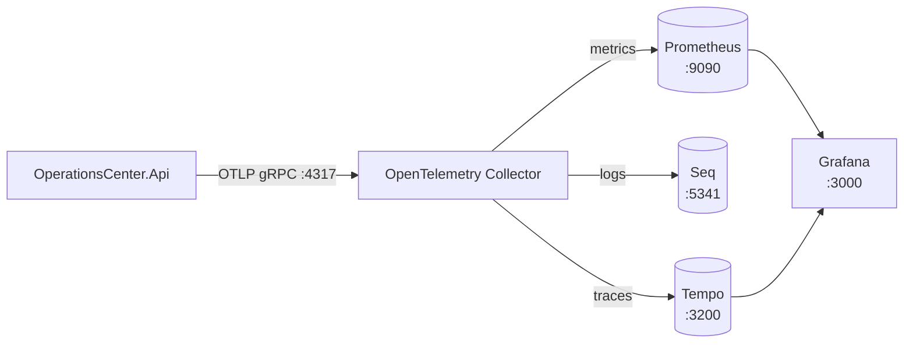

# ADR 0003: Use OpenTelemetry Collector with Prometheus, Grafana, Seq and Tempo

## Context

ADR 0002 established OpenTelemetry/OTLP instrumentation in the API itself, but
deliberately introduced no telemetry backend — traces, metrics and logs had
nowhere to land except a Collector's debug console.

Requirements for this phase:

- provide a runnable, containerized backend for all three signal types
  (metrics, logs, traces) for local development and portfolio demonstration;
- keep the application layer exactly as vendor-neutral as ADR 0002 already
  made it — the API must continue to know only about "an OTLP endpoint,"
  never about a specific backend product;
- make each backend genuinely optional at runtime: none of them may become a
  hard dependency for the API to start or serve requests;
- keep the setup reproducible from a clean checkout via Docker Compose, with
  no manual UI configuration steps;
- keep the footprint appropriate for a single-developer local/demo
  environment, not a production monitoring platform.

Constraints:

- no cloud telemetry backends, no paid services;
- no new application dependencies beyond what ADR 0002 already added;
- no orchestration platform (Kubernetes/Helm) — this stays Docker Compose.

## Decision

Introduce four backend services behind the existing OpenTelemetry Collector,
one per signal type (plus Grafana as the shared visualization layer over two
of them):

- **Prometheus** (`prom/prometheus`) — scrapes the Collector's Prometheus
  exporter endpoint (`:8889`). Chosen because the Collector can re-expose
  OTLP metrics as a scrape target natively, avoiding a push-based metrics
  backend and any vendor SDK in the API beyond the OTLP exporter it already
  has.
- **Grafana** (`grafana/grafana-oss`) — the single dashboarding surface, with
  both Prometheus and Tempo provisioned as data sources via files under
  `infra/observability/grafana/provisioning/`, and one starter dashboard
  (`operations-center-overview.json`) provisioned the same way. No manual
  "Add data source" step is ever required after `docker compose up`.
- **Seq** (`datalust/seq`) — chosen for logs because recent versions
  (2024.3+) accept OTLP log ingestion natively at a documented HTTP path
  (`/ingest/otlp/v1/logs`). This means the Collector only needs a generic
  `otlphttp`/`otlp_http` exporter pointed at that path — no Seq-specific
  exporter, no vendor code in the API.
- **Tempo** (`grafana/tempo`), single-binary mode, local disk storage —
  chosen for traces for the same reason: it accepts standard OTLP over gRPC,
  so the Collector uses its generic `otlp`/`otlp_grpc` exporter, and Grafana
  queries it as an ordinary data source via `Explore`.

All four are wired into the Collector's config
(`infra/observability/otel-collector-config.yml`) as three independent
pipelines (metrics/logs/traces), each `otlp` receiver → `batch` processor →
one or more exporters. The `debug` exporter stays attached to the traces and
logs pipelines alongside the real backends, so nothing is silently dropped
during troubleshooting even with a real backend attached.

### Why the Collector stays in the middle

The API was already pointed at "an OTLP endpoint" per ADR 0002. Every backend
added in this ADR is reached exclusively through the Collector — the API's
configuration and code did not change to add Seq or Tempo. This is the
concrete payoff of ADR 0002's vendor-neutral design: adding a backend is a
Collector-config change, never an application change.

### Resilience

Every new exporter relies on the Collector's default retry/sending-queue
behavior. If Seq or Tempo is down, the Collector queues and eventually drops
data for that signal — it does not block or fail the other pipelines, and it
never propagates back to the API. The API already tolerates an unavailable
Collector (ADR 0002); this ADR does not change that guarantee, it only adds
more things a running Collector can optionally talk to.

## Consequences

Positive:

- All three signals (metrics, logs, traces) are now genuinely explorable
  locally, not just theoretically exported.
- The API remains completely unaware of Seq/Tempo/Prometheus/Grafana as
  concrete products — only Collector configuration encodes that knowledge.
- Trace/log correlation is available "for free": OpenTelemetry's logging
  provider attaches `TraceId`/`SpanId` to log records inside an active trace
  without any code change, so a trace found in Tempo can be looked up
  directly in Seq by ID.
- Every backend is provisioned as code (Compose services, mounted config
  files, Grafana provisioning YAML) — a clean checkout reaches a fully wired
  state via `docker compose up --build`, with no manual clicking.

Tradeoffs:

- Four more containers to run locally — meaningfully heavier to bring up than
  before this ADR.
- No cross-signal correlation inside Grafana's UI itself (`tracesToLogs`/
  `tracesToMetrics`) — Seq has no Grafana data source plugin, so this was
  deliberately left out rather than half-implemented. Correlation today is
  "copy a trace ID, paste it into Seq's search," not a clickable link.
- No retention, backup, clustering or authentication hardening on any of the
  four new services — see "Current limitations."

## Alternatives considered

- **Jaeger instead of Tempo.** Rejected: Tempo integrates as an ordinary
  Grafana data source alongside Prometheus with no extra plugin, and accepts
  plain OTLP without a Jaeger-specific exporter.
- **Loki instead of Seq.** Rejected for this phase: Seq's native OTLP log
  ingestion and structured, filterable UI were a better fit for demoing
  "search real log fields," and Loki would need an explicit correlation setup
  with Grafana that Seq doesn't require to be useful standalone. Loki remains
  a candidate for a later step if in-Grafana log correlation becomes a
  priority.
- **Pushing metrics directly from the API to Prometheus (Pushgateway) or
  sending logs/traces directly to Seq/Tempo from the API.** Rejected: this
  would reintroduce vendor-specific code/config in the API, exactly what ADR
  0002 avoided by routing everything through the Collector.
- **Grafana Alloy or another all-in-one agent instead of the vanilla OTel
  Collector.** Rejected as unnecessary complexity — the plain
  `opentelemetry-collector-contrib` image already supports every exporter
  needed here.

## Current limitations

This is local development and portfolio-demo infrastructure, explicitly not a
hardened production monitoring platform:

- No authentication on Seq or Tempo; Grafana uses a single static dev
  admin/password pair. None of the four services are exposed through the
  frontend's reverse proxy — they're reached directly on their own ports,
  locally only.
- Tempo uses local-disk storage only (no S3/GCS/Azure Blob), single-binary
  mode (no clustering), and short retention (`block_retention: 1h`) — not
  appropriate for production trace volumes or durability.
- No alerting, SLOs, or dashboards beyond one starter dashboard.
- No log or metric retention policy tuning; all four backends run as
  single, unclustered instances with no backup story.
- Trace-to-logs/trace-to-metrics correlation inside Grafana's UI is not
  configured — correlation is manual (copy a trace ID from Tempo, search for
  it in Seq).

None of this is intended to be fixed by "trying harder" within the current
scope — it is out of scope until (if ever) this project needs to demonstrate
production-grade observability rather than local/demo observability.
